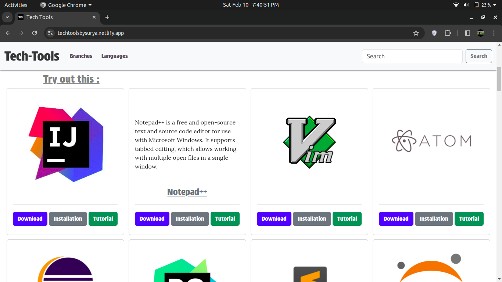
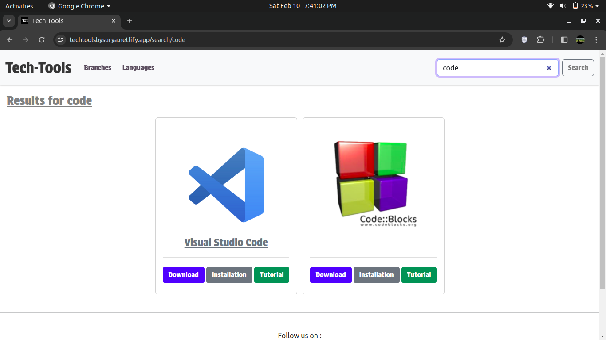
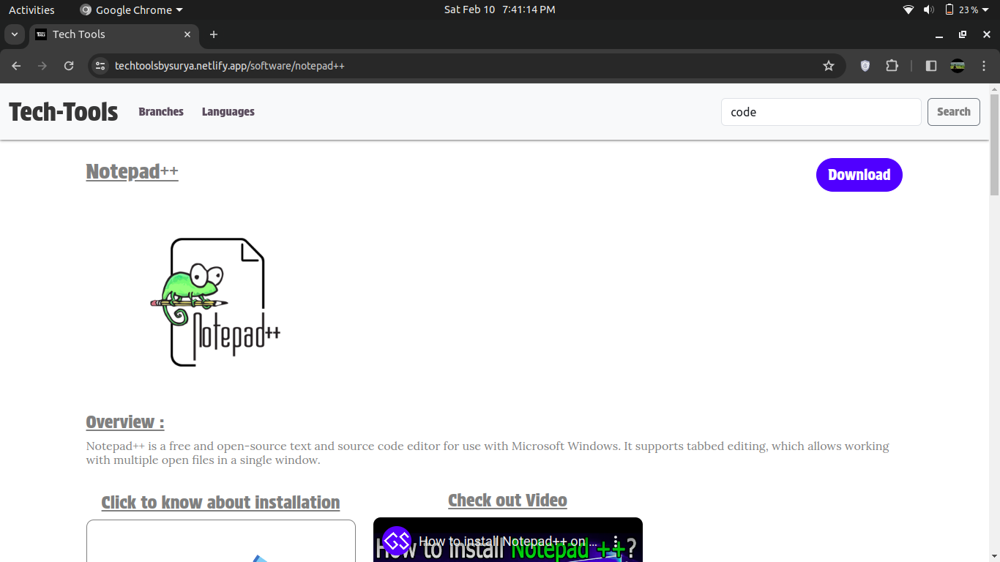

# Tech Tools

Tech Tools is a hub of different software branches, including tools for various purposes. It provides download links, installation guides, and tutorials in an interactive format. The application features search functionality, page navigation, and more to enhance user experience.

## Features

- **Software Branches:** Explore different categories of software tools.
- **Download Links:** Easily access download links for various software.
- **Installation Guides:** Follow step-by-step installation instructions.
- **Tutorials:** Learn how to use the software effectively through tutorials.
- **Search Functionality:** Quickly find the software you need.
- **Page Navigation:** Navigate seamlessly through the application.

## Installation

To run this application locally, follow these steps:

1. Clone this repository to your local machine.
2. Navigate to the project directory.
3. Run `npm install` to install all necessary dependencies.
4. Configure any environment variables if necessary.
5. Run `npm start` to start the development server.

## Usage

Once the application is running, you can access it through your web browser. Browse through different software branches, search for specific tools, and explore download links, installation guides, and tutorials.

## Contributing

Contributions are welcome! If you'd like to contribute to this project, please follow these steps:

1. Fork the repository.
2. Create a new branch (`git checkout -b feature/your-feature-name`).
3. Make your changes.
4. Commit your changes (`git commit -am 'Add new feature'`).
5. Push to the branch (`git push origin feature/your-feature-name`).
6. Create a new Pull Request.

